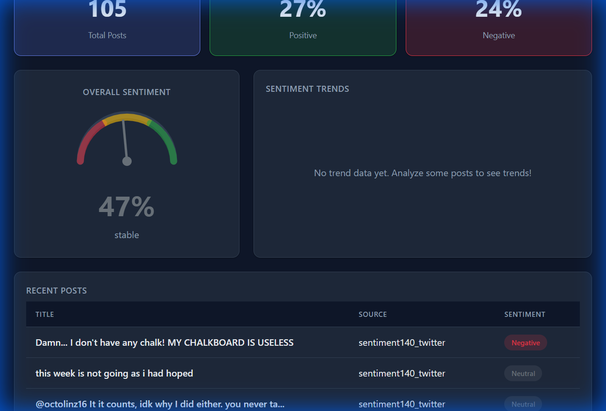

# Panchayat - Sentiment Analysis Dashboard

A full-stack sentiment analysis platform that combines advanced ML models with a modern React dashboard for real-time insights from Reddit, Twitter, and custom datasets.



## ✨ Features

- **🤖 ML Ensemble** - Hybrid model using BERT, LSTM (TextBlob), and Random Forest
- **📊 Real-time Dashboard** - Clean React UI with light/dark theme toggle
- **📈 Trend Analysis** - Time-series sentiment tracking
- **🔄 Multiple Data Sources** - Reddit API, CSV import, sample data
- **💾 SQLite Storage** - Persistent post storage with sentiment scores

## 🚀 Quick Start Guide

### 1. Clone the Repository

```bash
git clone https://github.com/RuchitAgrawal/panchayat.git
cd panchayat
```

### 2. Backend Setup (Python)

```bash
cd backend

# Create virtual environment
python -m venv venv

# Activate virtual environment
# Windows:
./venv/Scripts/activate
# Mac/Linux:
# source venv/bin/activate

# Install dependencies
pip install -r requirements.txt

# Run the server
uvicorn main:app --reload --port 8000
```
*Backend runs at: http://localhost:8000*

### 3. Frontend Setup (React)

Open a new terminal:
```bash
cd frontend

# Install dependencies
npm install

# Run development server
npm run dev
```
*Frontend runs at: http://localhost:5173*

---

## 📂 Using Kaggle Datasets

You can analyze large datasets like Sentiment140 (Twitter) or IMDB reviews.

1. **Download Dataset:**
   - [Sentiment140 (Twitter)](https://www.kaggle.com/datasets/kazanova/sentiment140)
   - [IMDB Movie Reviews](https://www.kaggle.com/datasets/lakshmi25npathi/imdb-dataset-of-50k-movie-reviews)

2. **Setup:**
   - Place the downloaded CSV file in `backend/datasets/`
   - Rename it to `sentiment140.csv` (or `imdb.csv`)

3. **Load Data via API:**
   ```bash
   # Example: Load 200 tweets
   curl -X POST http://localhost:8000/api/kaggle/sentiment140 \
     -H "Content-Type: application/json" \
     -d '{"limit": 200, "balanced": true}'
   ```

---

## 🔌 API Endpoints

| Endpoint | Method | Description |
|----------|--------|-------------|
| `/api/analyze` | POST | Analyze text sentiment |
| `/api/trends` | GET | Get real-time trends |
| `/api/posts` | GET | Fetch stored posts |
| `/api/sample/quick` | GET | Load built-in sample data |
| `/api/kaggle/status` | GET | Check available datasets |

## 🛠️ Tech Stack

**Backend:**
- FastAPI (Python)
- PyTorch + Transformers (BERT)
- scikit-learn (Random Forest)
- SQLite + SQLAlchemy

**Frontend:**
- React 18
- Vite
- Recharts (Visualization)
- CSS Variables (Theming)

## 📝 License

MIT License.
